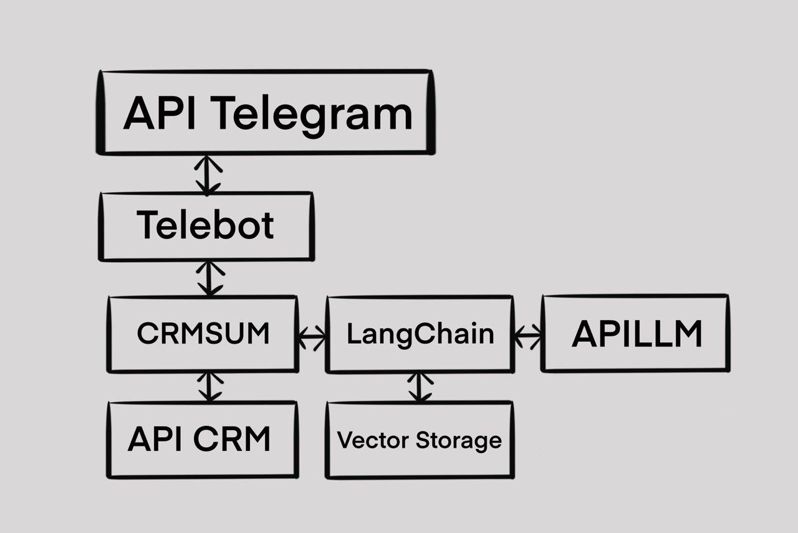

#  Cистема для анализа сделок AMOCRM и обобщения опыта продаж
## Архитектура приложения выглядит следующим образом

Этот репозиторий содержит код для приложения, которое подключается к системе учета сделок AMOCRM и агрегирует всю информацию по сделке в специальную таблицу. Далее мы векторизируем данную таблицу и с помощью chain prompt и GPT задаем вопросы по сделке, а OpenAI GPT отвечает на них.

## Зачем обобщать опыт продаж?
Чтобы больше и лучше продавать!

Где взять опыт продаж?

В CRM находятся карточки заказчиков и карточки контрактов, а продаваны делают там записи о каждом взаимодействии с заказчиком. У любого отдела продаж уже накопилась огромная база таких записей. Какие-то сделки провалились, какие-то сделки выстрелили.
В чем боль?

Продаваны не знают, что они делали хорошо и это привело к успеху, а что они делали плохо, что привело к неудаче. Им нужно это знать, чтобы лучше продавать и лучше удовлетворять клиентов.

## В чем решение?

Можно обобщить запись по всем успешным сделкам и по всем неуспешным. По успешным периодам и неуспешным. По успешным продавцам и неуспешным. В общем «успешный успех» на стероидах из статистики.\
## А как работает?

    Шаг 1: Продаваны задают вопрос обобщатору в свободной форме в духе «Что Ева делала за месяц по Теххренмашу?»
    Шаг 2: Обобщатор вылавливает:

    Имя: Ева
    Период: месяц
    Заказчик: Теххренмаш

    Шаг 3: Обобщатор стучится в CRM через API и выгружает все записи Евы по Теххренмашу за месяц.
    Шаг 4: Обобщатор суммирует опыт Евы за месяц по Теххренмашу, чтобы другие продаваны искали инсайты и учились.

Ноутбук с примерами использования: [https://github.com/mlenzovet/crmsum/blob/main/experiments/An%20example%20of%20using%20crmsum.ipynb](https://github.com/mlenzovet/crmsum/blob/main/experiments/An%20example%20of%20using%20crmsum.ipynb)https://github.com/mlenzovet/crmsum/blob/main/experiments/An%20example%20of%20using%20crmsum.ipynb

